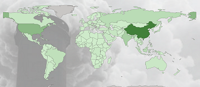

# THE FINAL DRAFT 

>I did a mini presentation on Green House gases (click the picture)

## My Updates 
>[Updated Views for Power BI Reporting.](https://github.com/Kadeen121/Greenhouse-Gases/tree/main/UpdatedViews).

>[Power B.I.](https://github.com/Kadeen121/Greenhouse-Gases/tree/main/GHG-PowerBI)

>[Plotly Vizualizations. ](https://github.com/Kadeen121/Greenhouse-Gases/tree/main/Plotly%20Visuals)

>[Plotly and Clustering Code via Jupyter Notebook. ](https://github.com/Kadeen121/Greenhouse-Gases/tree/main/Ploty%20and%20Clustering%20Code)

